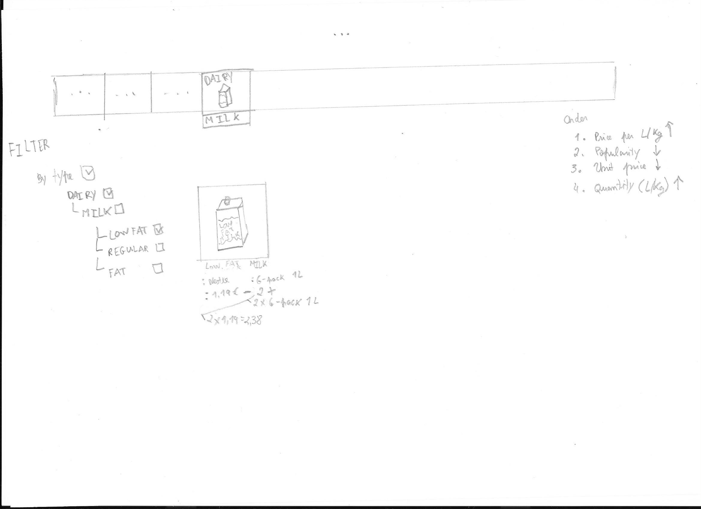

# Online Shop

## Briefing

During these troubled times the need for online shopping has risen. Even in times outside these, online shopping was still used because it is faster than physically going to the shop, as well being more convenient in the way that you can make the purchase whenever you like. Some shops have adopted and have created some online shops. However, these can have some issues with the interface, namely being too confusing, not displaying all the information or even being too hard.

## Scenarios

### Scenario 1

**Description**: We want to find a particular product: `chicken noodle soup`. It has to be of the `Campbell` brand.

**Task**: Search for desired product

### Scenario 2

**Task**: Add product to cart

**Description**: We want to buy `light milk`, but we don't want to spend a lot, so we'll go with the cheapest per L.

## Prototype

When we enter the site, this is the aspect of it.

## Sketches

### Scenario 1

Since we want chicken noodle soup, we might think it's in the `ready-made` category, so we search there.

A bunch of sub-categories appear, but nothing that we think is related to `soup`. Still, it probably is in this category! So let's search for everything in this category.

Unable to find it, we resign and switch to using the search bar at the top. A few items appear... some are `soup`, some are `chicken`. We know we want the `Campbell` brand, so we look for a way to filter that.

We find it in the right side, untick the rest, and at last, we get the wanted item.

### Scenario 2

We want `milk`, so we search in the `dairy` category. Upon opening it, we can see there is indeed a `milk` sub-category.

We click on it. Now, there are a few items. But we don't want just any `milk`. We want `light milk`. The closest we have is `low fat`. So, we untick all the other milks (by clicking the larger `milk[✓]`) and tick the `low fat`. We also now we want to save. So we drag `Price per L/Kg` to the top spot.

All that's left is to add the item to the cart. We want 2 * 6 packs (1L). So we click the `+` sign once, then another time.