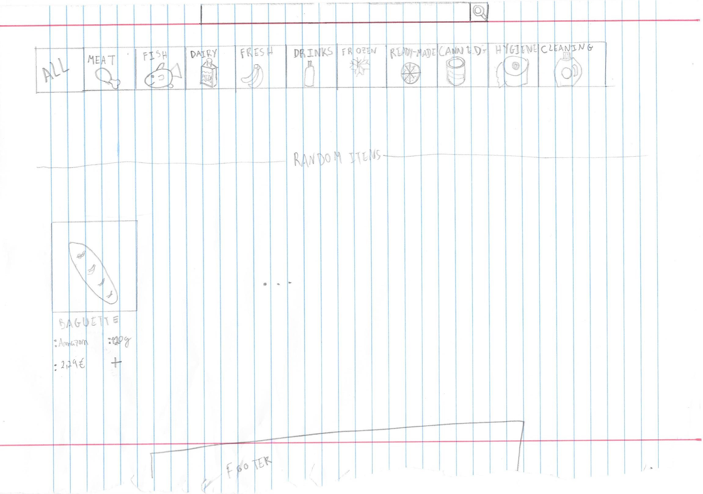
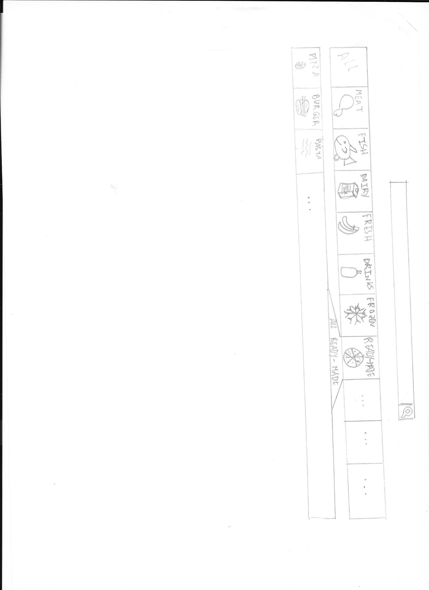
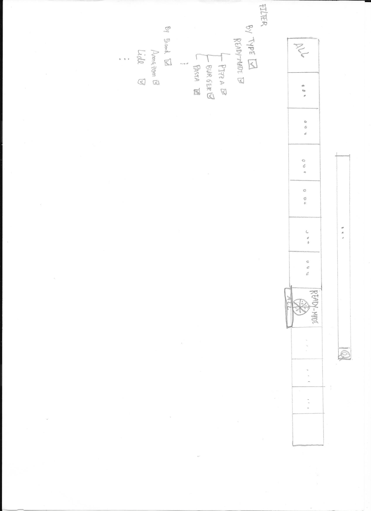
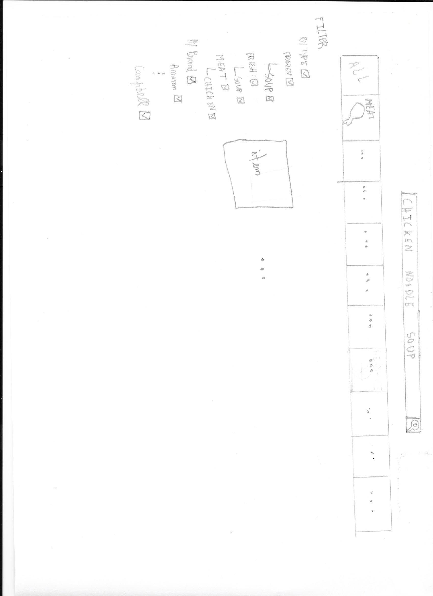
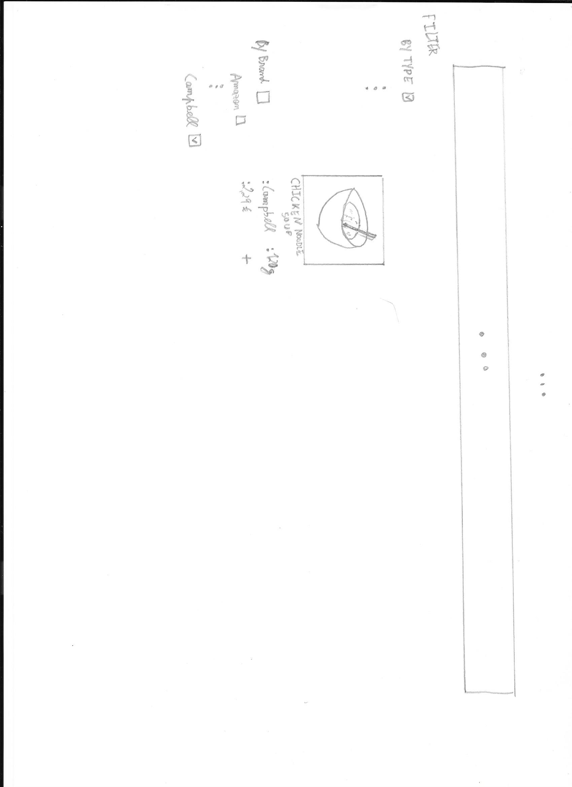
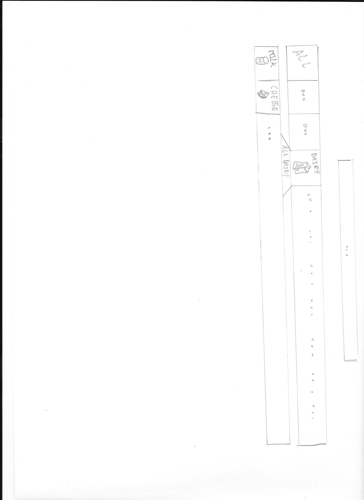
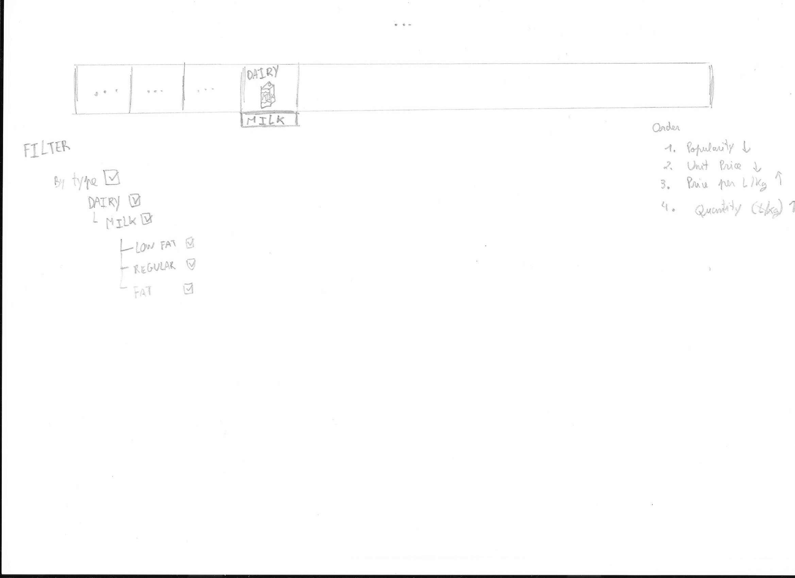
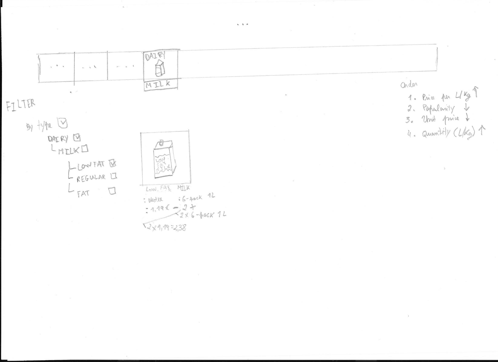

# Online Shop

David Pinto, m44094

## Problem description

Problem description: During these troubled times the need for online shopping has risen. Even in times outside these, online shopping was still used because it is faster than physically going to the shop, as well being more convenient in the way that you can make the purchase whenever you like. Some shops have adopted and have created some online shops. However, these can have some issues with the interface, namely being too confusing or not displaying all the information or even being too hard.

## Users

Users: The target people are those that can read and have a computer.
* Avid computer user – These users are used to seeing interfaces and can easily compare the interfaces they know to the new one, so they learn faster. 
* Average computer user – These users have some train using interfaces and can therefore adapt some of the concepts to the new interface.
* Beginner computer user – These users don’t have a lot of interfaces “training” and so must learn everything new.

## Tasks

Tasks: 
1. Search for the desired product
2. Add prodto cart
3. Modify quantity from cart
4. Remove from cart
5. Do checkout
6. See cart
7. Remove cart

## Other applications

Other applications: 
* Intermaché
    * Good:
        * The main menu is divided in many categories, all of which have a picture and a text describing them
        * Once you select a “main” menu, there can be more sub-menus that are very specific (For example: “Fruits”/” Apples”)
        * You can filter by brand
        * You can filter by price
        * You can do a general search for any word and you will be given a list of possible matches
    * Bad:
        * When you do a general search, as you type, a few products with a word matching could appear under the search area
        * When one adds quantities of products, some have flat numbers: 5 units (of Xg) others have KG (2,5 KG and each unit has 0,5KG)
        * Unable to search for a whole category, for example “Fruits”
        * Unable to “bulk search”. It’s not possible to, given a list separated by newlines, do a search for every line, essentially doing concurrent searches.
        * Impossible to search for unit above X kg. This must be done manually by checking.

## Paper protoype

### Scenarios

#### Scenario 1

**Description**: We want to find a particular product: `chicken noodle soup`. It has to be of the `Campbell` brand.

**Task**: Search for desired product

#### Scenario 2

**Task**: Add product to cart

**Description**: We want to buy `light milk`, but we don't want to spend a lot, so we'll go with the cheapest per L.

### Prototype

When we enter the site, this is the aspect of it.

### Sketches

#### Scenario 1

Since we want chicken noodle soup, we might think it's in the `ready-made` category, so we search there.

A bunch of sub-categories appear, but nothing that we think is related to `soup`. Still, it probably is in this category! So let's search for everything in this category.

Unable to find it, we resign and switch to using the search bar at the top. A few items appear... some are `soup`, some are `chicken`. We know we want the `Campbell` brand, so we look for a way to filter that.

We find it in the right side, untick the rest, and at last, we get the wanted item.

#### Scenario 2

We want `milk`, so we search in the `dairy` category. Upon opening it, we can see there is indeed a `milk` sub-category.

We click on it. Now, there are a few items. But we don't want just any `milk`. We want `light milk`. The closest we have is `low fat`. So, we untick all the other milks (by clicking the larger `milk[✓]`) and tick the `low fat`. We also now we want to save. So we drag `Price per L/Kg` to the top spot.

All that's left is to add the item to the cart. We want 2 * 6 packs (1L). So we click the `+` sign once, then another time.

## Computer prototype

### Startup instructions

Open a chromium based browser (as these are the only ones tested) and go to https://daxtery.github.io/interfaces/

### Scenarios

#### Scenario 1

**Description**: We want to find a particular product: `chicken noodle soup`. It has to be of the `Campbell` brand.

#### Scenario 2

**Description**: We want to buy `light milk`, but we don't want to spend a lot, so we'll go with the `cheapest per L`. Once we've found it, we should add it to the cart.

#### Scenario 3

**Description**: We want to see the cart.

#### Scenario 4

**Description**: We want to remove a product from the cart.

#### Scenario 5

**Description**: We want to add a product to the cart.

#### Scenario 6

**Description**: We should be able to checkout, finishing our order.

### Incomplete

- The results from a search (either by category or by the search bar) still need to be paginated.

- The results from a search (either by category or by the search bar) still need to be able to be ordered: by `popularity`, `unit price`, `price per kg/l`, `quantity kg/l`. Any combination of these either ascending or descending.

- The checkout part still has no interface.

- Clicking an item still doesn't do anything. It should open a dialog where more details are shown.

## Computer-prototype Problems

### by Sahan

#### number 1

| Problem  | Desc | Severity | Solution
| - | - | - | - |
| Rectangular area belongs to one item | Don’t see clear margins of rectangle shaped area | Low | Make it Popup when mouse pointer placed on it

The suggested solution was implemented. Now the product will "grow" slightly when the user hovers the product.

#### number 2

| Problem  | Desc | Severity | Solution
| - | - | - | - |
| Search option use for non-existing items generate no error | When use search option to search an item which is not in this list such as bread, jam, chicken, it opens a blank window | Mild | Place a message on the window as “Item not found”

As per suggested: When a search is perfomed that yields no results, as per the suggested solution, the system now tells you so with a helpful message. In that message it is reported that the searched term couldn't be found and gives some possible solutions.

#### number 3

| Problem  | Desc | Severity | Solution
| - | - | - | - |
| Item details not enough  | No access to further details about the item such as availability, available quantity, discounts, ingredients, weight, calorie amount etc.. | Low | Create a function to go inside the product and show such details 

As suggested: A dialog is now spawned when the user clicks the image of the product. It reveals all the information that was previously available and a few other details such as ID, Calories, Stock, price per L/Kg, categories, weight in kg/L. 

#### number 4

| Problem  | Desc | Severity | Solution
| - | - | - | - |
| No user conformation required in checkout process | When executing checkout command it directly do the payment without confirm the payment. So it limits the user freedom to cancel the process at the last time | High | Before do the payment, there should be a step to confirm the payment.

The solution was as sugested: A confirmation dialog now appears when performing the checkout. 

#### number 5

| Problem  | Desc | Severity | Solution
| - | - | - | - |
| Not issuing a printed bill | After the checkout process the system not issuing a proof for the payment and it limits the user’s | Mild | When checkout is confirmed, the customer should have a proof of the payment.

As sugested the fix to this problem is a dialog where the details about the purchase appear (after having confirmed the checkout).

#### number 6

| Problem  | Desc | Severity | Solution
| - | - | - | - |
| Malfunctioning when returning to previous window  | When go back to the previous page from the checkout page using previous window button in Chrome, the window visualizes with abnormal arrangement of items and large fonts | High | Should be corrected it to link the previous page the user worked with. 

I was never able to reproduce this bug...

#### number 7

| Problem  | Desc | Severity | Solution
| - | - | - | - |
| Undo function is not working properly | Icon mimicking half circle arrow (return) in the check-out window is removing only the last item in the check-out list | Mild | Function of the button should be the removing one items per one click

This is working as intended, the system is only able to undo the very last action. This is meant to help with users that completely remove some item from the cart and (right after) wish to undo that action. Of course, it works for any action: add, remove, delete item from cart.

#### number 8

| Problem  | Desc | Severity | Solution
| - | - | - | - |
| Difficult to find the area to click on for execute checkout command  | Check-out button seems like a word phrase rather than a button. User must be confused due to its appearance | Mild | The appearance of the check-out button should be change

As sugested, this button received some changes:

Not only was the icon changed (as it was difficult to understand) but it was made bigger and red color was added. The button is now also disabled if no items are present in the cart.

#### number 9

| Problem  | Desc | Severity | Solution
| - | - | - | - |
| Not use of arrow keys to move in to adjacent items | The ability to use arrow keys to reach adjacent item would be a time saving strategy for vice users | low | It is more convenient if there is a function to move from one item to adjacent item by using arrow keys

I disagree with this being a problem in the sense that this kind of application requires a lot of mouse . In the case of it being a simple slideshow of products this would make sense - but, in order to make it fully functional with keyboard, other shortcuts would have to be added (otherwise it would be a constant change between mouse and keyboard) for all the actions: selecting a category from the menu, disabling/enabling brand and category filters, adding to cart, removing from cart, going to cart, going to homepage, going to search field, changing order filters. There are a lot of actions that are not easily translated to keyboard.  

### by Davide

#### number 1

| Problem  | Desc | Severity | Solution
| - | - | - | - |
| Top Categories Menu Stack | The sub-menus risk to stack too much and "crowd" the window | Minor | Use a Window Menu

The suggested solution was implemented. The categories now are menus.

#### number 2

| Problem  | Desc | Severity | Solution
| - | - | - | - |
| Asymmetric Results | In "ToDo List" | Minor | Absolute size for the box

This problem is now at least somewhat addressed: all the products are now aligned by the bottom.

#### number 3

| Problem  | Desc | Severity | Solution
| - | - | - | - |
| Checkout Size Button | Checkout button is hard to see | Major | Make it bigger or use different colours (i.e. red)

This was [also a problem presented by Sahan] // TODO . The solution is the same as presented there:

> Not only was the icon changed (as it was difficult to understand) but it was made bigger and red color was added. The button is now also disabled if no items are present in the cart.

The color is the same as suggested as it is fitting.  

#### number 4

| Problem  | Desc | Severity | Solution
| - | - | - | - |
| No Existing Items | If a search gives 0 results, the system do not "communicates" it to the user  | Major | Print a message on the screen

This was [also a problem presented by Sahan] // TODO . The solution is the same as presented there:

> When a search is perfomed that yields no results, as per the suggested solution, the system now tells you so with a helpful message. In that message it is reported that the searched term couldn't be found and gives some possible solutions. 

#### number 5

| Problem  | Desc | Severity | Solution
| - | - | - | - |
| Info About Product  | In "ToDo List"  | Major | Create a modal with information

This was [also a problem presented by Sahan] // TODO . The solution is the same as presented there:

> A dialog is now spawned when the user clicks the image of the product. It reveals all the information that was previously available and a few other details such as ID, Calories, Stock, price per L/Kg, categories, weight in kg/L.

#### number 6

| Problem  | Desc | Severity | Solution
| - | - | - | - |
| Checkout Confirmation  | In "ToDo List"  | Major | Make a confirmation pop up

This was [also a problem presented by Sahan] // TODO . The solution is the same as presented there:

> A confirmation dialog now appears when performing the checkout. 

#### number 7

| Problem  | Desc | Severity | Solution
| - | - | - | - |
| Checkout Impasse  | In "ToDo List"  | Major | Make a back-home button after payment

To solve this problem the solution used is an automatic redirecting to the home page. The fact that the proposed solution only mentioned one button (back-home) means this is probably the only action that users will want to perform upon reaching this phase anyway.

The redirect happens once the checkout is performed.

## Demo

The latest version is possible to view by openning a chromium based browser (as these are the only ones tested) and go to https://daxtery.github.io/interfaces/